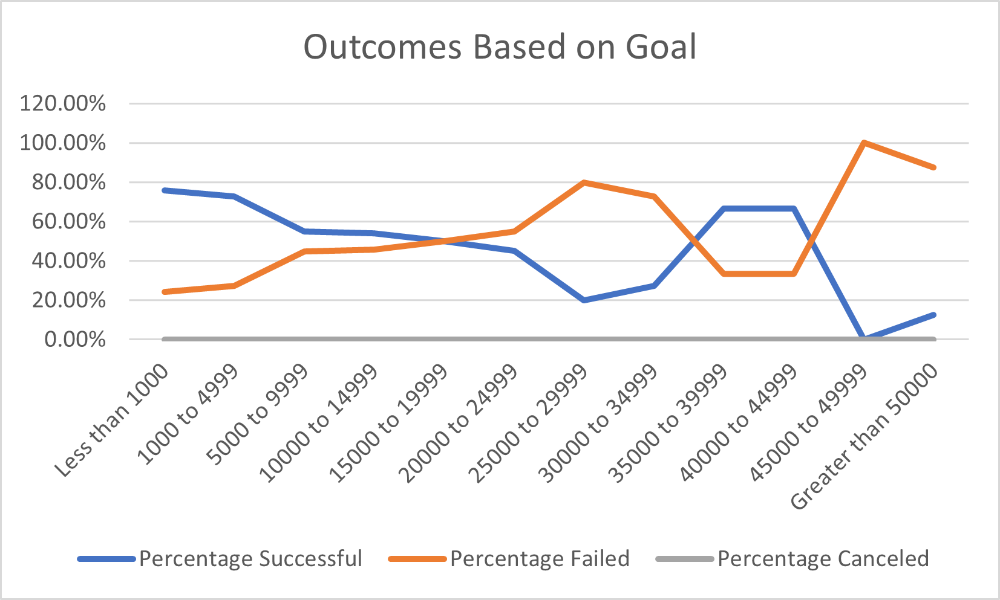

# Kickstarting with Excel

## Overview of Project

Module 1 Challenge.  This project involves using Microsoft Excel to analyze data pertaining to Kickstarter fundraising campaigns across a wide variety of project categories, from a number of countries, spanning a period of multiple years.

### Purpose

The purpose of this project is to enable the end user of our analysis to better understand the factors that may impact the ultimate success or failure of a Kickstarter campaign, with a specific emphasis on analyzing projects which involved raising funds for Theater projects, and specifically Plays within the broader Theater category.  As a result of the analysis that we have performed, the end user will be in a position to better understand how the Campaign Launch Date and the Campaign Funding Goal may impact the overall likelihood of successfully meeting the campaign's fundraising goal. 

## Analysis and Challenges

### Analysis of Outcomes Based on Launch Date

The first phase of our analysis involved analyzing campaigns for Theater projects, in an attempt to understand the impact, if any, that the Launch Date of a Campaign may have on the overall likelihood of a Campaign successfully reaching its fundraising goal.  In order to accomplish this analysis, a Pivot Table was created, which details the number of campaigns which were ultimately Successful, Failed, or Canceled, based on the month in which the campaign was launched.

This analysis yielded the following table, and corresponding visualization:

### Analysis of Outcomes Based on Goals

The second phase of our analysis involved analyzing campaigns raising funds for Plays, in an attempt to understand the relationship, if any, between the fundraising goal and the ultimate success or failure in reaching that fundraising goal.  In order to accomplish this analysis, Campaigns were grouped based on their Fundraising Goal, and the percentage of campaigns within each group that were Successful, Failed, or Canceled was calculated.

This analysis yielded the following table, and corresponding visualization:

### Challenges and Difficulties Encountered

There were no challenges or difficulties encountered in completing this project.  However, one important caveat to note is that this dataset contains data related to campaigns in multiple currencies, and no effort was made to account for this lack of normalization when analyzing the data.  In particular, the Outcomes based on Fundraising Goals is impacted by this lack of currency normalization, with the results being less accurate than if efforts had been made to account for the various currencies included in the dataset.     

## Results

Based on our analysis, the following conclusions can be drawn from the analysis of Outcomes Based on Launch Date:

1. Campaigns for Theater projects launched in May and June are historically most likely to reach their fundraising goal; in addition, May and June are also the months in which the greatest number of Campaigns are launched.

2. Campaigns for Theater projects launched in December are historically least likely to reach their fundraising goal; in addition, December is also the month in which the fewest number of Campaigns are launched.

Based on our analysis, the following conclusions can be drawn from the analysis of Outcomes Based on Goals:

1. Campaigns for Plays with a Fundraising Goal of less than 20,000 are most likely to succeed, with campaigns seeking less than 5,000 succeeding nearly 75% of the time; Campaigns seeking less than 5000 also account for nearly 70% of total campaigns launched during the period analyzed.

### Limitations

As discussed previously, one of the most significant limitations of this dataset is the lack of currency normalization.  In addition, as this data provides only a summary of all data associated with a Campaign, rather than details on each of the underlying transactions, we are deprived of the opportunity to analyze individual contributions in greater detail, to better understand the outsized impact that large donations may have had on the success of a particular campaign.

### Opportunities for Additional Tables and/or Graphs

Additional analysis could be undertaken to provide insight into the duration of campaigns, as well as to allow for greater understanding regarding the number of Backers and Average Donation associated with Campaigns that are similar to our End User's proposed campaign. 
